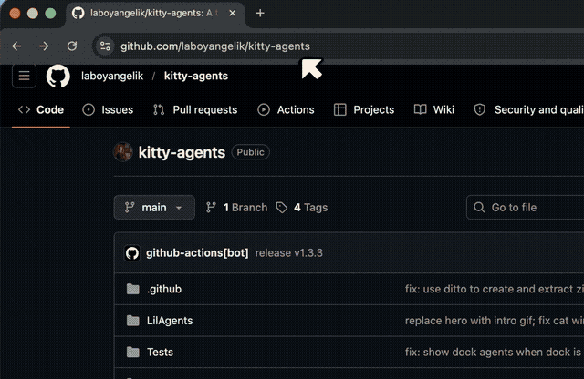

# kitty agents


A tiny AI cat that lives on your macOS dock. Built on top of [lil agents](https://github.com/ryanstephen/lil-agents) by [@ryanstephen](https://github.com/ryanstephen) — go give that repo a star. Uses the cat animation from [Cat Pomodoro](https://rive.app/marketplace/27136-51126-cat-pomodoro/) on Rive.

**kitty agents** sits above your dock, vibing. Click to open an AI terminal and chat. It thinks, idles, and silently judges you.

Supports **Claude Code**, **OpenAI Codex**, **GitHub Copilot**, **Google Gemini**, and **OpenCode** — switch between them from the menu bar.

---

## installing

Open **Terminal** (press `⌘ Space`, type `Terminal`, press Enter) and paste this:

```bash
curl -fsSL https://raw.githubusercontent.com/laboyangelik/kitty-agents/main/install.sh | bash
```

That's it — kitty agents downloads, installs itself, and opens automatically. The app keeps itself up to date from then on via Sparkle.



## requirements

- macOS Sonoma 14.0 or later
- Apple Silicon or Intel Mac

At least one AI provider — Claude, Codex, Gemini, Copilot, OpenCode, or OpenClaw. The app will detect what you have installed automatically, and can walk you through installing Claude, Codex, or Gemini from inside the chat.

### subscription & cost

Most of these AIs aren't free. The companies charge for the AI's "thinking time" — billed in **tokens** (bite-size chunks of text; a short message is roughly 20–50 tokens, a page of code a few hundred). You're charged a small fraction of a cent per token.

Rough idea of what each one costs:

- **Claude** (Anthropic) — $20/month for Claude Pro, the easiest option for regular use; or pay-per-use via API
- **Codex** (OpenAI) — pay-per-use; typically a few cents per message
- **Gemini** (Google) — has a free tier generous enough for casual use
- **GitHub Copilot** — requires a GitHub Copilot subscription ($10/month individual or included in GitHub Pro)
- **OpenCode** — billed through whichever AI backend you configure it with

You'll set up billing directly with whichever company you pick when you create an account. kitty agents itself is free and open source (MIT).

---

## features

- Rive-animated cat that lives above your dock
- Click to open an AI chat terminal popover
- **`⌘K` global shortcut** — brings the cat and chat to the front from any app
- **Built-in install wizard** — for Claude, Codex, and Gemini, click the install button and the app walks you through setup without ever opening a terminal
- Animated loading indicator while installs are running so you always know it's working
- 7 cat colors: Gray, Ungu, Blue, Calico, Black, White, Orange
- Switch AI providers per-character from the menu bar
- Thinking bubbles and animated status while your agent is working
- Model picker — switch between opus/sonnet/haiku (Claude) or flash/pro (Gemini) without leaving the chat
- MCP server support for Claude
- Sound effects on completion
- Launch at login
- Resize the cat: Large, Medium, or Small
- Pin to a specific display on multi-monitor setups
- Triple-tap the kitty to quit
- Auto-updates via Sparkle

---

## keyboard shortcut

| shortcut | what it does |
|---|---|
| `⌘K` | bring kitty and the chat window to the front from any app |

---

## chat commands

Type any of these in the chat input:

| command | what it does |
|---|---|
| `/clear` | wipe the conversation and start a new session |
| `/copy` | copy the last response to your clipboard |
| `/model` | open an interactive model picker (↑↓ to select, enter to confirm) |
| `/model opus` | switch directly to a specific model alias |
| `/mcp` | list your configured MCP servers |

---

## provider setup

For **Claude**, **Codex**, and **Gemini** — you don't need to set anything up manually. Click the **install** button in the app (next to the hammer icon in the chat header) and kitty agents will walk you through creating an account and getting everything configured right in the chat window.

For providers without a built-in flow, install manually:

**GitHub Copilot**
```
brew install copilot-cli
```
Then run `copilot auth` to authenticate with your GitHub account.

**OpenCode**
```
curl -fsSL https://opencode.ai/install | bash
```

**OpenClaw** — a self-hosted AI gateway. Install and run it, then paste your auth token in the app settings.

Once a CLI is installed and authenticated, it shows up automatically in menu bar → Provider. Unavailable providers are grayed out.

---

## menu bar


Click the cat icon in the menu bar to access:

- **Hide / Show Cat** — toggle kitty on and off
- **Sounds** — turn sound effects on or off
- **Provider** — switch AI providers (only installed ones are enabled)
- **Color** — pick kitty's color
- **Size** — Large, Medium, or Small
- **Display** — pin kitty to a specific monitor
- **Launch at Login** — start automatically on login
- **Check for Updates** — manually check for a new version
- **Quit** — close the app

---

## building from source

Clone the repo, open `lil-agents.xcodeproj` in Xcode, and hit Run.

---

## privacy

kitty agents runs entirely on your Mac and sends nothing on its own.

- **Your data stays local.** The app draws animations and calculates your dock position. No personal data is collected or transmitted by the app.
- **AI providers.** Conversations go through whichever CLI you pick, running locally on your machine. kitty agents does not intercept or store your chat content. What gets sent to the AI provider is governed by their own privacy policy.
- **No accounts.** No login, no analytics, no user database.
- **Updates.** Sparkle checks for updates and sends your app version and macOS version. Nothing else.

---

## license

MIT — see [LICENSE](LICENSE) for details.
