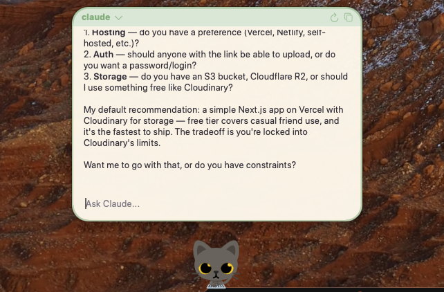

# kitty agents



A tiny AI cat that lives on your macOS dock.

**Pixel** sits above your dock, vibing. Click to open an AI terminal and chat. She thinks, she idles, she judges you silently.

Supports **Claude Code**, **OpenAI Codex**, **GitHub Copilot**, and **Google Gemini** CLIs — switch between them from the menu bar.

---

> built on top of [lil agents](https://github.com/ryanstephen/lil-agents) by [@ryanstephen](https://github.com/ryanstephen) — go give that repo a star  
> cat animation from [Cat Pomodoro](https://rive.app/marketplace/27136-51126-cat-pomodoro/) on Rive Marketplace

---

## features

- Pixel the cat rendered with Rive animations
- Click her to open an AI terminal popover
- 7 cat colors to choose from — Gray, Ungu, Blue, Calico, Black, White, Orange
- Switch AI providers from the menu bar
- Thinking bubbles while your agent is working
- Sound effects on completion
- Launch at login
- Triple tap Pixel to quit the app
- Auto-updates via Sparkle

## requirements

- macOS Sonoma (14.0+)
- Apple Silicon or Intel Mac
- At least one CLI installed:
  - [Claude Code](https://claude.ai/download) — `curl -fsSL https://claude.ai/install.sh | sh`
  - [OpenAI Codex](https://github.com/openai/codex) — `npm install -g @openai/codex`
  - [GitHub Copilot](https://github.com/github/copilot-cli) — `brew install copilot-cli`
  - [Google Gemini CLI](https://github.com/google-gemini/gemini-cli) — `npm install -g @google/gemini-cli`

## building

Clone the repo, open `lil-agents.xcodeproj` in Xcode, and hit run. That's it.

## menu bar

Click the cat icon in your menu bar to access everything:

- **Hide / Show Cat** — toggle Pixel on and off
- **Sounds** — turn sound effects on or off
- **Provider** — switch between Claude, Codex, Copilot, and Gemini. Only providers you have installed will be enabled. See [provider setup](#provider-setup) below
- **Color** — pick Pixel's color: Gray, Ungu, Blue, Calico, Black, White, or Orange
- **Display** — pin Pixel to a specific monitor if you have multiple screens
- **Launch at Login** — toggle whether the app starts automatically when you log in
- **Check for Updates** — manually check for a new version
- **Quit** — close the app

## provider setup

Each provider needs its own CLI installed and authenticated before it shows up as available.

**Claude Code**
```
curl -fsSL https://claude.ai/install.sh | sh
```
Then run `claude` once and log in.

**OpenAI Codex**
```
npm install -g @openai/codex
```
Set your `OPENAI_API_KEY` env variable.

**GitHub Copilot**
```
brew install copilot-cli
```
Run `copilot auth` to authenticate with your GitHub account.

**Google Gemini**
```
npm install -g @google/gemini-cli
```
Run `gemini` once and follow the login flow.

Once a CLI is installed and authenticated, open the menu bar → Provider and select it.

## quitting

Triple-tap Pixel to quit the app. Or use menu bar → Quit.

## privacy

Pixel runs entirely on your Mac and sends nothing anywhere.

- **Your data stays local.** The app plays Rive animations and calculates your dock position. No personal data is collected or transmitted.
- **AI providers.** Conversations go through the CLI you pick, running locally on your machine. lil agents does not intercept or store your chat content. What gets sent to the provider is governed by their own privacy policies.
- **No accounts.** No login, no analytics, no user database in the app.
- **Updates.** Sparkle checks for updates and sends your app version and macOS version. Nothing else.

## license

MIT License. See [LICENSE](LICENSE) for details.
